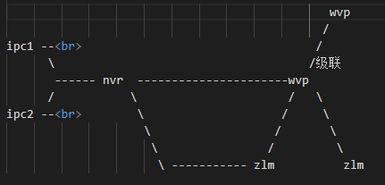

## wvp-zlm 配置注意事项

- 1. zlm与assist要在一台机器上
- 2. zlm与wvp-pro部署
     - 在同一台机器部署时与不同机器上部署时稍有差别
     - 核心点就是能够相互通信即可

### 整体架构

### wvp-pro配置

- redis          信息配置
- wvp web服务    nginx反向代理
- sip端口  确保下级sip或者nvr或者ipc可以访问
- sip信息 sip客户端要配置（下级sip或者nvr或者ipc可以访问）
    - domain: 3301077099 域 
    - id: 33010770992587049864 国际标号
    - password: Zpo2DvRzevePrzsVRx392k
        - *根据国标6.1.2中规定，domain宜采用ID统一编码的前十位编码。国标附录D中定义前8位为中心编码（由省级、市级、区级、基层编号组成，参照GB/T 2260-2007*

- zlm    
    - ip:  119.23.67.55
    - stream-ip:  119.23.67.55 这个用于推流
    - sdp-ip:  119.23.67.55 
    - hook-ip: 127.0.0.1 
    - secret: 035c73f7-bb6b-4889-a715-d9eb2d1925cc 与 zlm中一致即可 
    - rtp 推流一般采用多端口
    - record-assist-port: 18081
      - 若有录像端口配置 与assist中一致

### zlm配置

- web服务器端口  
- 服务器id 

### assist配置

- 服务端口配置
- 录像路径配置 与zlm中一致

### 安装

- cd  /home
- git clone https://github.com/YangChengTeam/wvp_zlm.git wvp
- 修改各个配置文件 主要是ip配置
- cd wvp
- sh install.sh
